# Eka: плагины для Zynthian

[English](README.md) · **Русский**

Четырнадцать LV2-плагинов для [Zynthian](https://zynthian.org), у каждого свой виджет для тачскрина: аудио-лупер,
MIDI-лупер, генеративный арпеджиатор, гранулярный сэмплер, синтезатор West Coast, гранулярный эффект, четырёхголосый питч-гармонизатор, ритмический мультиэффект-шейпер, однополосный живой компрессор, 4-полосный параметрический эквалайзер, стерео/полиритмический живой дилей, 16-пэдовый драм-сэмплер с секвенсором, 3D-процессор пространства и стереорасширения, а также шестирежимный «Über-Mod» модулятор. Сделаны для живой игры на
Raspberry Pi 5 и для работы вместе в одном сетапе.

> Проверено на: Zynthian **Vangelis** (stable 2610), Raspberry Pi 5, набор V5, тачскрин 800x480.
> Другие версии и железо не проверялись.

## Плагины

### [Eka Tape](plugins/tape): аудио-лупер для живой игры

Парты из стерео-дорожек, управление ногами: запись, овердабы без предела, undo / redo, Lock дорожек в следующий
парт, неразрушающая обрезка Trim, скорость и высота у каждой дорожки, микшер, сохранение сессий со звуком. Идёт за темпом Zynthian как плёнка.

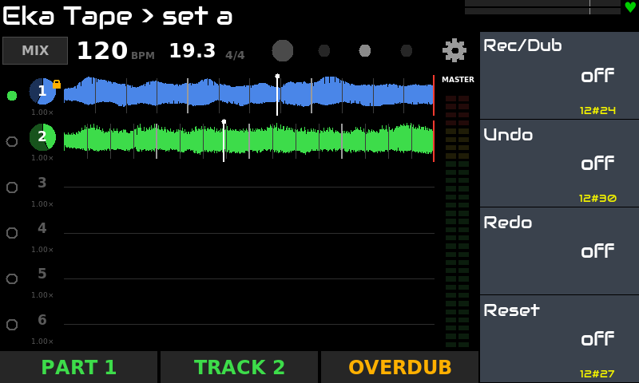

### [Eka Roll](plugins/roll): MIDI-лупер

Пишет и наслаивает ноты и движения контроллеров по слоям в такт с транспортом Zynthian; квантизация,
транспонирование по слоям, 16 слотов на диске, экспорт в MIDI-файл и в паттерн секвенсора Zynthian.

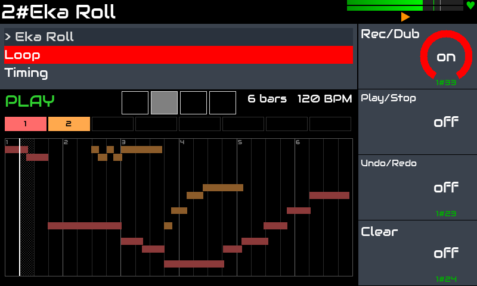

### [Eka Bloom](plugins/bloom): генеративный арпеджиатор

16 шагов с вероятностью, высотой, велосити, гейтом и трещотками, у каждой строки своя длина; лады и ступени,
нотный цикл в духе Turing Machine, медленная мутация; живые эффекты на пэдах (roll, fill, drop…) и XY-пэд.

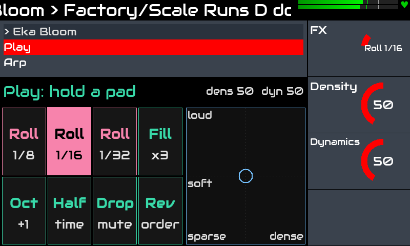

### [Eka Mist](plugins/mist): гранулярный сэмплер

Каждая нота растит облако зёрен из сэмпла: позиция и скан, размер и плотность зёрен, высота с притяжением к ладу,
фильтр в каждом голосе, LFO и огибающие на сетке модуляции. 8 голосов, ограниченный пул зёрен.

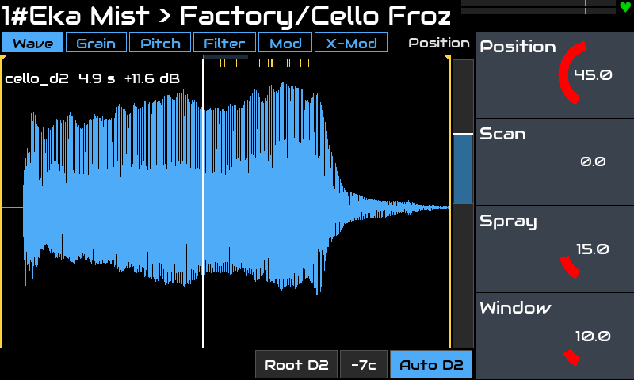

### [Eka Fold](plugins/fold): полифонический синт West Coast

Пара осцилляторов с FM, AM и Sync, волновой фолдер, lopass gate на модели вактрола, функциональные генераторы,
матрица модуляции и струна / дилей / резонатор в каждом голосе. До 8 голосов.

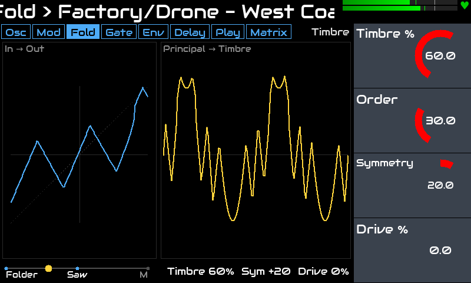

### [Eka Grain Flow](plugins/grainflow): гранулярный эффект для живого входа

Три потока превращают входной звук в развивающиеся облака: частичный и полный Freeze, сканирование буфера,
стереоширина, квантование высоты, два LFO с синхронизацией и входная огибающая на матрице модуляции. 25 пресетов.


### [Eka Weave-4](plugins/weave4): четырёхголосый питч-гармонизатор

Четыре голоса гармонии плюс сухой сигнал: интервалы, 14 типов аккордов с голосоведением, диатонические лады или
управление целевыми нотами по MIDI со встроенным детектором высоты входного сигнала; в каждом голосе — дилэй с
синхронизацией темпа, расстройка и гуманизация, фильтры HPF/LPF, четыре сцены (A–D) и 9 фабричных пресетов.

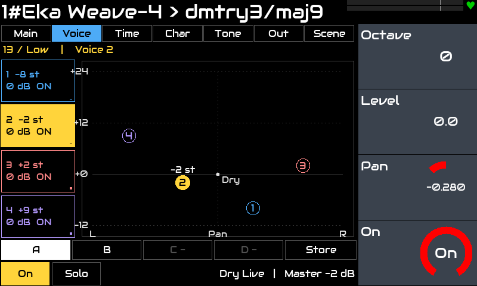

### [Eka Pulse](plugins/pulse): ритмический мультиэффект-шейпер

Четыре полиритмических слота (`TIME`, `DRIVE & CRUSH`, `FILTER`, `GATE & SPACE`) с независимой длиной `1..16` шагов, кроссовер `Low Split` с `Low Duck`, Audio/MIDI-триггеры, `Env → Depth`, экран живой игры `Perform` (3×3 моментальных пэда + XY-пэд + четыре сцены A–D) и 24 заводских пресета.


### [Eka Press](plugins/press): однополосный живой компрессор

Четыре характера сжатия (`Clean`, `Opto`, `Punch`, `Glue`), сайдчейн-фильтр `SC HPF` (`20..500 Гц`), `Stereo Link`, `Auto Release`, прослушивание детектора `SC Listen`, аналоговый `Drive`, `Auto Makeup`, параллельный `Mix`, мягкий потолок `Soft Clip` (`-0.3 дБ`), плавный `Bypass`, интерактивная кривая сжатия с бегущей лентой Gain Reduction и 10 заводских пресетов.


### [Eka Q-4](plugins/q4): 4-полосный параметрический эквалайзер

Четыре 64-битные параметрические полосы (`Shelf`, `Bell`, `Pultec`, `Notch`, `Air`, `Off`), фильтры Баттерворта `HPF`/`LPF` (`12`/`24 дБ/окт`), качели `Tilt` вокруг `1 кГц`, глобальный масштаб `Scale`, прослушивание полосы `Solo`, автокомпенсация `AutoGain`, плавный `Bypass`, 24-полосный живой анализатор спектра на фоне интерактивного графика АЧХ и 10 заводских пресетов.

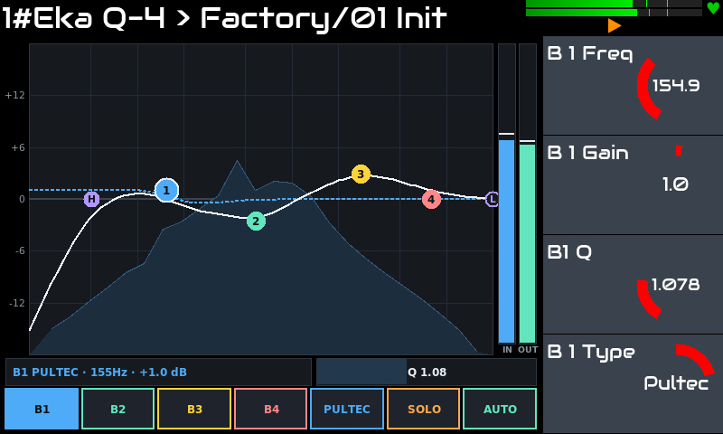

### [Eka Echo](plugins/echo): стерео и полиритмический концертный дилей

Независимая задержка L/R с интерполяцией Эрмита (`5..2500 мс`) и BPM Sync (`1/64..1 bar`), четыре характера (`Clean`, `Tape` с инерцией ленточного мотора, `BBD`, `Diff`), три стерео-роутинга (`Stereo`, `PingPong`, `Cross`), фильтры петли `HPF`/`LPF`, `Drive`, `Diffuse`, LFO-модуляция, `Duck`, `Freeze`, `Trails`, отдельный живой экран **FX** с X-Y пэдом (`Time FX`, `Filter FX`, `Wash FX`, пружинный режим `SNAP 0`, MIDI-сброс `FX Zero`) и 10 заводских пресетов.

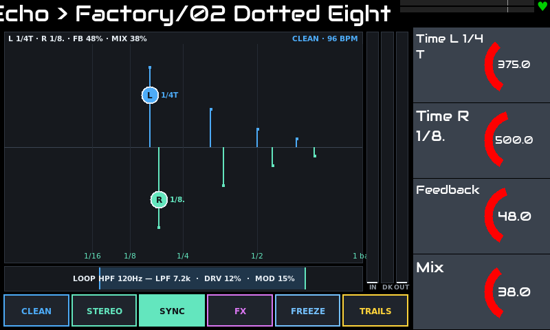

### [Eka Pads](plugins/pads): 16-пэдовый драм-сэмплер и полиритмический секвенсор со сценами

Драм-сэмплер с сеткой 4×4 для пэдовых контроллеров вроде M-VAVE SMC-PAD Pocket: 16 независимых пэдов с фоновой загрузкой WAV/FLAC, анти-алиасинг питч, decay, биполярный DJ-фильтр, punch, drive/crush, 4 choke-группы, биполярный `Width`, 4 стерео-сенда `Aux` в Mixbus Zynthian, матрица модуляции на 4 слота (2 LFO + Env Follower), автофокус последнего нажатого пэда на 4 энкодера Zynthian и полиритмический 32-шаговый секвенсор со сценами, живой записью Overdub, velocity/вероятностью/трещотками на шаг и экспортом в ZynSeq.

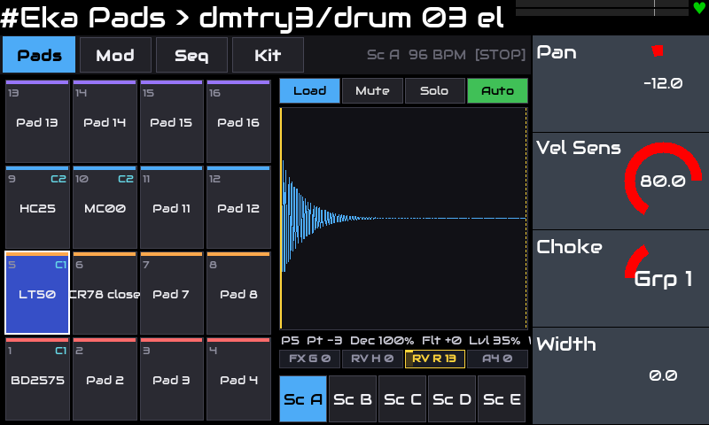

### [Eka Space](plugins/space): 3D-сцена, многорежимное стереорасширение и пространственная модуляция

Позиционирование на 2D-сцене (`Pan`, `Width` `0..300%`, `Depth`, спектральный наклон `Tilt`), пять движков стереорасширения (`M/S`, моно-совместимый `Comb`, психоакустический `Haas`, квадратурный `Dimension`, 4-каскадный all-pass `Vortex`) с ранними отражениями комнаты (`Room`), синхронизированная с темпом пространственная LFO-модуляция (`Pan`, `Breathe`, `Orbit`, `Figure-8`, `Drift`), моно-якорь баса `Bass Mono` (`20..500 Гц`), `Side HPF` / `Side Air`, динамическая ширина `Env Width`, прослушивание `Audition` (`Stereo/Mono/Mid/Side`), защита фазы `SafePhase`, отдельный живой экран **FX** с X-Y пэдом (`Pan FX`, `Width FX`, `Spin FX`) и 10 заводских пресетов.

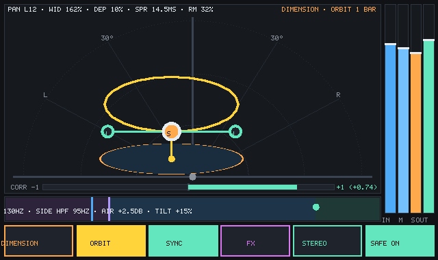

### [Eka Modls](plugins/modls): 6-режимный «Über-Mod» модулятор

Шесть самостоятельных алгоритмов модуляции (`Chorus`, 3-фазный ансамбль `Tri-Mod`, плёночный Through-Zero `Flanger`, 4..12-каскадный `Phaser`, бесконечный фазер Шепарда `Barber` и 8-отводное диффузное облако `Uber`), 6 форм LFO (`Sine`, `Tri`, `Exp`, `S&H`, `Chaos`, `Env`) с BPM Sync (`4 bars .. 1/64`), `OverMod` (от музыкального до аудио-частотного FM и хаоса), `Diffuse`, аналоговый `Drive`, `Low Cut` / `High Cut`, биполярный `Env Mod`, `LFO Freeze`, отдельный живой экран **FX** с X-Y пэдом (`Comb FX × Warp FX` + `Rate FX`) и 14 заводских пресетов.

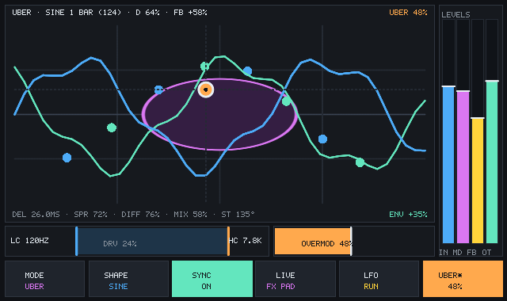

## Сетап

Типичная цепочка: **Pads** задаёт ритм (с посылами Aux в **Echo** или **Pulse**), **Roll** пишет аккорды, **Bloom** превращает их в живое арпеджио, его играет **Fold** или **Mist**, **Weave-4** строит четырёхголосную гармонию для живого инструмента (или следует за аккордами из **Roll**), **Grain Flow** и **Echo** преобразуют звук, **Tape** закольцовывает всё вместе с вашим инструментом, **Q-4** выстраивает тональный баланс и убирает резонансы, а **Press** держит динамику входа или склеивает общую шину. Каждый плагин работает и сам по себе.

## Установка

На Zynthian (SSH под root):

```bash
git clone https://github.com/dmtry3/zynthian-eka.git
cd zynthian-eka
sudo make install-bloom          # один плагин: tape, roll, bloom, mist, fold, grainflow, weave4, pulse, press, q4, echo, pads, space или modls
sudo make install                # или все
systemctl restart zynthian
```

Обновление:

```bash
cd /root/zynthian-eka && git pull && sudo make install && systemctl restart zynthian
```

Каждый плагин собирается на устройстве и ставит бандл LV2 в `/usr/local/lib/lv2`, а виджет в
`zyngui/widgets_user`; файлы самого Zynthian не меняются. `sudo make uninstall-<плагин>` или
`sudo make uninstall` удаляют их. Подробности — в README каждого плагина.

## Сборка на любом Linux

```bash
make                 # все плагины
make bloom           # один плагин
make -C plugins/bloom test
```

## Лицензия

GPL-3.0-or-later, см. [LICENSE](LICENSE) (и файл `LICENSE` в каждом плагине). Сторонний код и сэмплы перечислены в `THIRD_PARTY.md` и
`samples/CREDITS.md` плагинов.
